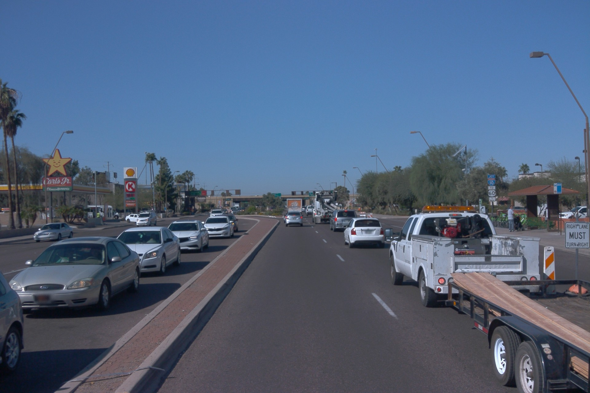
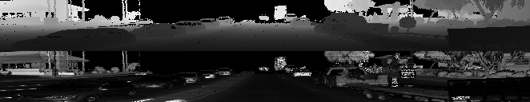
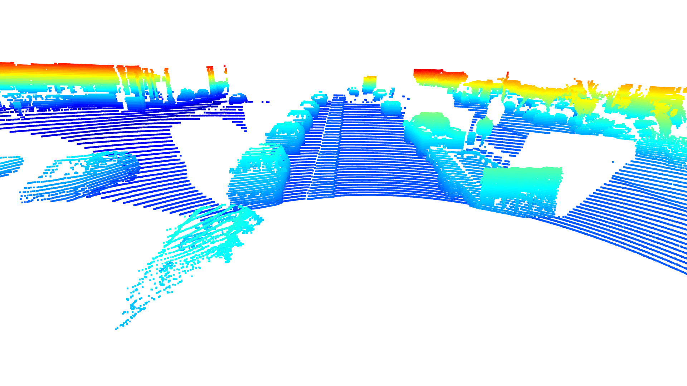

# Writeup: Mid-Term Project: 3D Object Detection

This is the mid-term project for the second course in the Udacity Self-Driving Car Engineer Nanodegree Program : Sensor Fusion. 

Tasks in section 1 are about displaying information from lidar data in the Waymo Open dataset which are stored as a range images.

The following images show the resulting data representation.  
Image of the front camera

  
Range image 
Top half represents range (white is furthest away) 
Bottom half represent intensity of laser reflection (white is highest intensity) 

  
Point cloud image 

 
In the point cloud image, vehicles that are close are much better visible than vehicle which are further away. For the vehicles with "good" visibility, the windows, especially the windscreen can clearly be identified. Also the tires and in most cases the rear-view mirror are visible in the point cloud image. The upper part of the car (windows and roof) can be distinguished from the lower part (doors, hood, trunk, bumpers). Vehicles with white color seems to have higher reflectivity and therefore show higher intensity in the range images.

