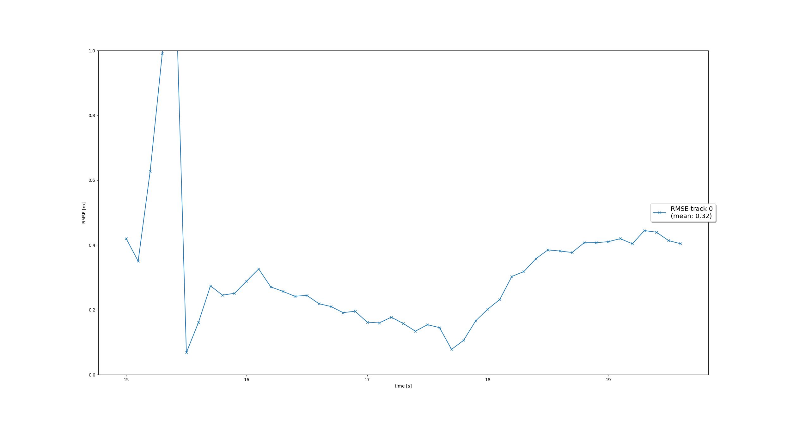
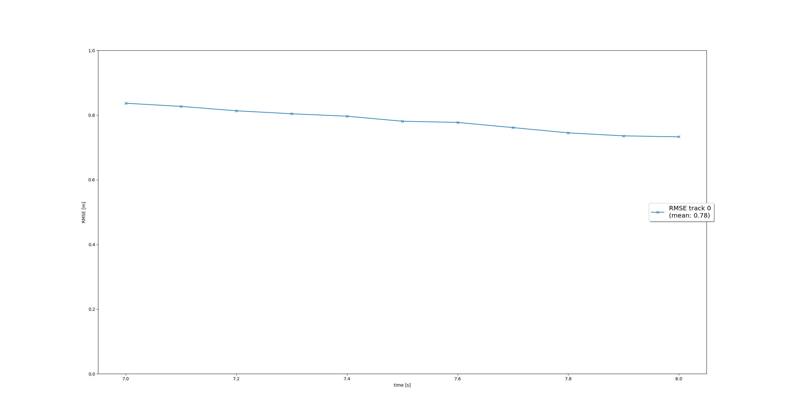
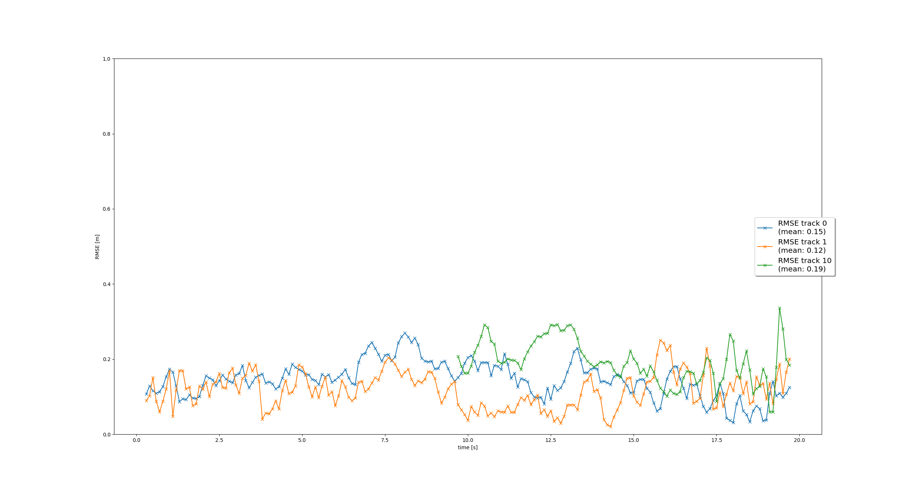
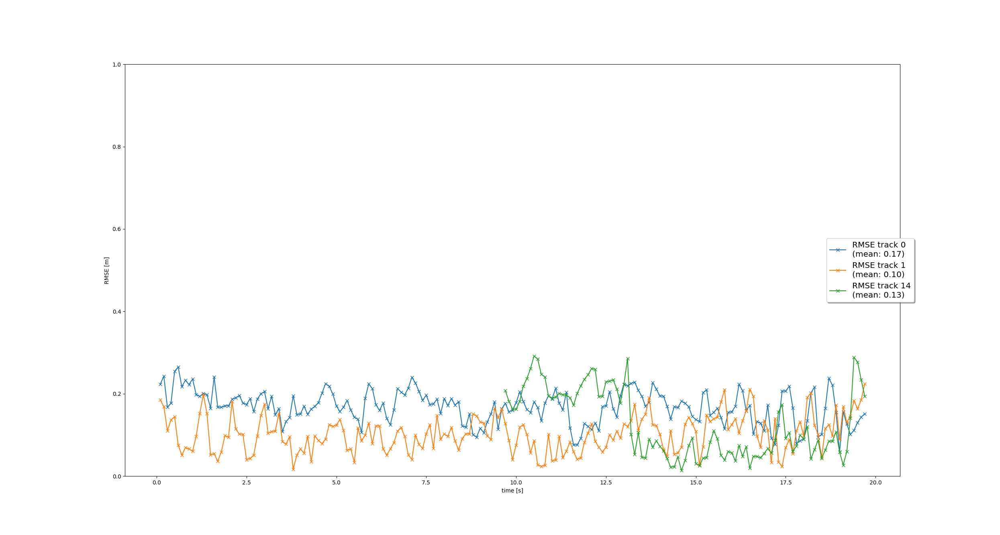

# Writeup: Track 3D-Objects Over Time

This is the final project for the second course in the Udacity Self-Driving Car Engineer Nanodegree Program : Sensor Fusion.  
The goal of the final project is, to implement a sensor fusion system that is able to track vehicles over time with real-world camera and lidar measurements.  
The final project consists of four main steps: 
Step 1: Implement an extended Kalman filter. 
Step 2: Implement track management including track state and track score, track initialization and deletion. 
Step 3: Implement single nearest neighbor data association and gating. 
Step 4: Apply sensor fusion by implementing the nonlinear camera measurement model and a sensor visibility check.  

## Extended Kalman filter
In this step, an EKF has been implemented:
- Predict and update steps
- System matrix for constant velocity process model in 3D
- Process noise covariance matrix
- Residual and residual covariance
The filter has been tested on a provided single track using lidar data.

## Track management
A track management has been added, which increases or decrease the track score depending on measurement data, visibility and state estimate covariance. 
A track state is then assigned according to the track score. 
Testing with lidar data showed, that the track management works as expected with tracks being created and deleted according to the implemented rules. 
The resulting RMSE is quite high. This is because the lidar detections contain a y-offset, which cannot be compensated by the the Kalman filter as it expects zero-mean data. 

## Single nearest neighbor data association and gating
To be able to track multiple tracks, the measurement data needs to be associated with existing tracks. This has been implemented in this this. 
The test showed, that multiple object (up to 3 in this test) can be tracked and that “ghost tracks” did not reach track state "confirmed" and where deleted relatively quickly. 
The RMSE plot shows reasonable results.

## Apply sensor fusion to track objects using camera and lidar measurement data
The last step ws about implementing a nonlinear camera measurement model. With the first try, I did not take the extrinsic camera transformation (vehicle to camera) into account, the function h(x) did just implement the intrinsic transformation (image to camera). This led to a poor tracking performance as the resulting Mahalanobis distances for camera measurement were very high and did not pass the gate. After fixing this issue, the performance where quite amazing (at least for me).

[Video of tracking multiple objects using camera and lidar measurement data](img/my_tracking_results.avi)

## Benefits in Camera-Lidar Fusion tracking over Lidar-only tracking
In theory, there are many reason for using more than one sensor and more than one sensor type for object tracking:
- Different measurement principles which may complement each other so that object tracking is possible even in adverse environmental conditions (precipitation, fog, ..)
- Higher system availability (at least for a limited time) due to redundancy  
In the project (step 4), the impact was notable (ghost track were even faster deleted). As the conditions in the test scenario where quite good in terms of environmental conditions, the impact on tracking quality was not significant.

## Challenges of sensor fusion system
One challenge of a sensor fusion system is the measurement data. It needs to comply to the assumption made during design of the fusion system, otherwise the fusion system may not deliver the needed performance. During the project, this could be seen in step 2 where a offset in lidar data resulted in a mean RMSE of about 0.8. In real world project, a substantial effort need to be put into sensor calibration and diagnosis in order to provide measurement data with the required quality.  
Another challenge are the number of objects, which need to be tracked in complex situations. In the end, all relevant objects need to tracked, but all ghost tracks need to be deleted as soon as possible.

## Ways to improve the tracking results in the future
It might be beneficial, to more than two sensor, e.g. radar, other cameras and lidars. 
The track management can be improved, to that the visibility is check even if there no measurement from any sensor. 
For me, it' still a lot to discover and to learn. For example to get a better intuition of the kalman noise parameters, the impact of sensor data deviation (e.g. offset) and how to mitigate them.
